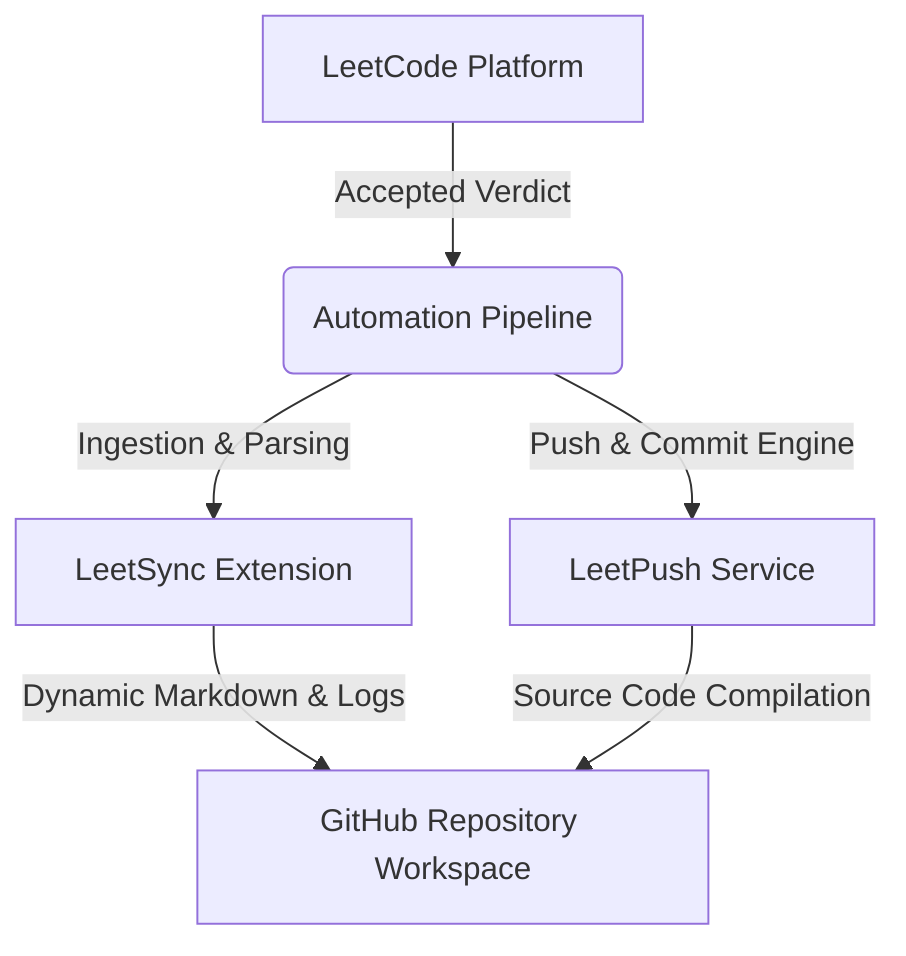

# Algorithmic Engineering & Advanced Data Structures

An enterprise-grade, hybrid-automated archive containing production-ready solutions to algorithmic challenges on LeetCode. This repository serves as a centralized reference library to demonstrate technical proficiency in core computational theory, space-time complexity optimization, and software architectural design patterns.

---

## 🛠️ Core Technologies & Automation

**Platform:** LeetCode (`Purushottam36`) | **Languages:** Python 3, Java SE | **Automation Engine:** LeetSync & LeetPush Pipeline


### 📈 Profile Performance Analytics

```text
====================================================================
  LEETCODE METRICS LOG  |  USER: Purushottam36
====================================================================
  [✓] Platform Sync     : Active via LeetSync & LeetPush
  [✓] Core Languages    : Python3 (.py) | Java (.java)
  [✓] Compilation       : Production Ready, Optimized
  [✓] Sync Frequency    : Real-Time on "Accepted" Verdict
====================================================================
```

> 💡 *Note: To view my real-time visual progress graphics, problem counts, and global ranking percentiles dynamically, explore my official live account metrics directly on the [LeetCode Dashboard](https://leetcode.com).*

---


## 🔗 Professional Verification

* **LinkedIn Network:** [Connect via LinkedIn](https://www.linkedin.com/in/kumar-purushottam6136)
* **Verified Profile:** [LeetCode Dashboard](https://leetcode.com)

---

## ⚙️ Architecture & Automation Pipeline

This codebase utilizes a dual-pipeline automation framework to seamlessly ingest, format, and push production code execution metrics directly from the platform.



* **LeetSync Integration:** Manages automated runtime polling, abstracting the problem statements, constraints, and parsing difficulty mappings directly into documentation assets.
* **LeetPush Engine:** Handles continuous version control delivery, instantly routing solution updates, tracking runtime latency percentiles, and recording memory footprints inside the commit metadata.

---

## 📂 Repository Hierarchy

*Note: This workspace uses a consolidated, unified layout where algorithmic concepts, file types, and structures coexist seamlessly within an accessible, continuous root architecture.*

```text
├── 📁 [Problem_ID]_[Problem_Title]/   # Unified modular problem directory
│   ├── solution.py                     # Multi-paradigm Python 3 implementation
│   ├── Solution.java                   # Strongly-typed Object-Oriented Java implementation
│   └── README.md                       # Auto-generated problem description & mathematical constraints
└── README.md                           # Main repository architectural guide
```

---

## 🎯 Domain Expertise Matrix

| Paradigm | Computational Focus | Core Technical Frameworks Applied |
| :--- | :--- | :--- |
| 🔢 **Linear Data Primitives** | Space-Optimized Sequences | Sliding Windows • Two-Pointer Convergence • Monotonic Stacks • Hash Tables |
| 🕸️ **Non-Linear Topologies** | Structural Network Traversal | DFS/BFS Implementations • Trie Operations • Disjoint-Set Unions (Union-Find) |
| 📉 **Optimization Engines** | State-Space Reduction | Top-Down Memoization • Bottom-Up Tabulation • Greedy Heuristics |
| 🧮 **Mathematical Logic** | Low-Level System Controls | Bitwise Masking • Combinatorics • Number Theory Foundations |

---

## 📈 Engineering Credentials & Milestone Ledger

The ledger below maps out earned badges, problem accuracy metrics, and programmatic milestones securely archived from my LeetCode dashboard history.

| Milestone / Credential | Focus & Verification | Acquired / Status | Valuation |
| :--- | :--- | :--- | :--- |
| 🏗️ **Architecture Builder Badge** | System Design & Infrastructure Scaling | `2026-08-24` | **ARCHIVED** |
| 🛠️ **Algorithm Deconstructor Badge** | Advanced Logic & Computational Flow | `2026-08-16` | **ARCHIVED** |
| 🧮 **Mathematical Insight Badge** | Number Theory & Formula Derivations | `2026-07-15` | **ARCHIVED** |
| 🌐 **Data Navigator Badge** | Structural Search & Traversal Logic | `2026-07-12` | **ARCHIVED** |
| 📅 **Daily Challenge Track** | Consistency & Routine Optimization | `ACTIVE` | **IN PROGRESS** |

---

## 💡 Code Design & Review Framework

All source code complies with modern software architecture patterns by maintaining strict engineering guardrails:

1. **Space-Time Efficiency:** Prioritizing solutions that run within optimal Time Complexities ($O(N)$ or $O(N \log N)$) while minimizing Auxiliary Space Memory footprints ($O(1)$ setups).
2. **Enterprise Readability:** Rejecting cryptic shorthand variables. Source code utilizes clean, semantic variable naming patterns and descriptive method signatures.
3. **Defensive Programming:** Architecting custom fallback patterns to confidently isolate system boundary exceptions, null pointers, and integer type overruns.

---
*Automated reporting generated securely via LeetSync & LeetPush workflows.*
